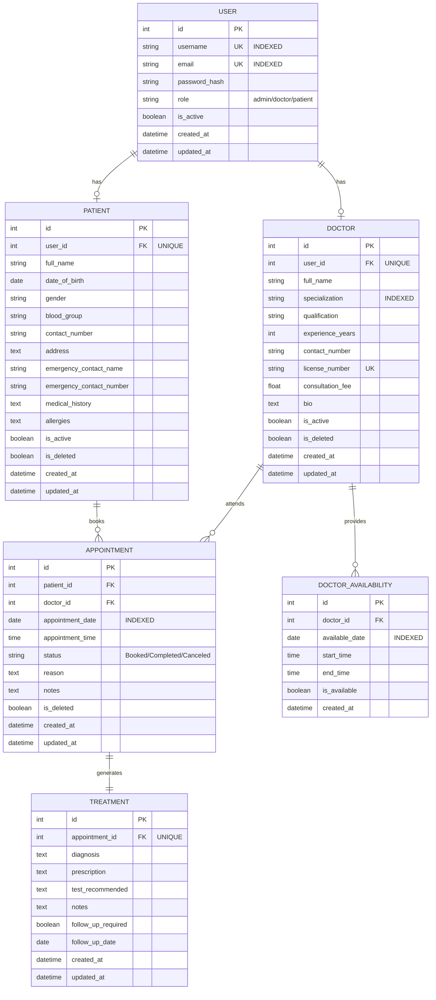

# Hospital Management System
## MAD-1 Project Report

---

### Student Details
**Student Name:** [To be filled by student]  
**Roll Number:** 2KXXXX  
**Course:** Modern Application Development - I  
**Project:** Hospital Management System  
**Date:** [To be filled by student]

---

## 1. Project Overview

### Introduction
The Hospital Management System (HMS) is a comprehensive web-based application designed to streamline hospital operations by digitizing and automating key processes such as patient registration, doctor management, appointment scheduling, and treatment record maintenance. This system addresses the inefficiencies of manual record-keeping and disconnected software systems prevalent in many healthcare facilities.

### Objectives
- **Centralized Data Management:** Create a unified platform for managing patient records, doctor profiles, and appointments
- **Role-Based Access Control:** Implement secure, role-specific interfaces for Admins, Doctors, and Patients
- **Efficient Scheduling:** Prevent appointment conflicts through automated slot validation and availability management
- **Complete Medical Records:** Maintain comprehensive treatment history with diagnosis, prescriptions, and follow-up information
- **Enhanced User Experience:** Provide intuitive interfaces with real-time data visualization and responsive design

### Problem Statement
Hospitals currently face challenges with:
- Manual registers prone to errors and data loss
- Scheduling conflicts and double bookings
- Difficulty tracking patient medical history across visits
- Limited search and reporting capabilities
- Lack of centralized access to critical information
- Inefficient communication between patients, doctors, and administrative staff

This HMS provides a modern, efficient solution to these challenges through a unified web application.

---

## 2. Technology Stack & Frameworks

### Backend Technologies
- **Flask 3.0.0:** Python web framework for application logic and routing
- **SQLAlchemy 2.0.23:** ORM (Object-Relational Mapping) for database operations
- **Flask-Login 0.6.3:** User session management and authentication
- **Flask-Mail 0.9.1:** Email notification support
- **Werkzeug 3.0.1:** Password hashing and security utilities
- **Python-dotenv 1.0.0:** Environment variable management

### Frontend Technologies
- **HTML5:** Semantic markup and structure
- **CSS3:** Custom styling and animations
- **Bootstrap 5.3:** Responsive design framework
- **JavaScript:** Client-side interactivity and validation
- **Chart.js:** Data visualization for statistics and analytics
- **Jinja2:** Server-side templating engine

### Database
- **SQLite:** Relational database management system
- Programmatically created using SQLAlchemy models
- Supports ACID transactions for data integrity

### Development Tools
- **Flask Development Server:** Local testing environment
- **Email Validator 2.1.0:** Form validation for email fields
- **Git:** Version control (optional)

---

## 3. System Architecture & Approach

### MVC Architecture
The application follows the **Model-View-Controller (MVC)** design pattern for clean separation of concerns:

**Models (`models/`):**
- Define database schema and relationships
- Handle data validation and business logic
- Implement soft delete pattern for data preservation
- Classes: User, Doctor, Patient, Appointment, Treatment, DoctorAvailability

**Views (`templates/`):**
- Jinja2 templates for dynamic HTML rendering
- Organized by role: admin/, doctor/, patient/
- Reusable base template with template inheritance
- Responsive Bootstrap-based UI components

**Controllers (`routes/`):**
- Flask blueprints for modular routing
- Handle HTTP requests and form submissions
- Implement business logic and authorization
- Modules: auth, admin, doctor, patient, api, main

### Project Folder Structure
```
hospital_management_system/
├── app.py                      # Application entry point
├── config.py                   # Configuration settings
├── extensions.py               # Flask extensions initialization
├── requirements.txt            # Project dependencies
├── models/                     # Database models
│   ├── __init__.py
│   ├── user.py                # User authentication model
│   ├── doctor.py              # Doctor profile model
│   ├── patient.py             # Patient profile model
│   ├── appointment.py         # Appointment booking model
│   ├── treatment.py           # Medical records model
│   └── doctor_availability.py # Availability scheduling
├── routes/                     # Application routes (controllers)
│   ├── __init__.py
│   ├── auth.py                # Login/registration
│   ├── admin.py               # Admin portal
│   ├── doctor.py              # Doctor portal
│   ├── patient.py             # Patient portal
│   ├── api.py                 # REST API endpoints
│   └── main.py                # Public pages
├── templates/                  # Jinja2 templates (views)
│   ├── base.html              # Base template
│   ├── login.html, register.html
│   ├── admin/                 # Admin templates
│   ├── doctor/                # Doctor templates
│   ├── patient/               # Patient templates
│   └── errors/                # Error pages
├── static/                     # Static assets
│   ├── css/                   # Stylesheets
│   ├── js/                    # JavaScript files
│   └── images/                # Image assets
└── utils/                      # Utility functions
    ├── decorators.py          # Custom decorators
    └── helpers.py             # Helper functions
```

### Key Design Decisions

**1. Soft Delete Pattern:**
- Records marked as `is_deleted=True` instead of permanent deletion
- Preserves data integrity and audit trails
- Allows data recovery if needed

**2. Role-Based Access Control (RBAC):**
- Three distinct roles: Admin, Doctor, Patient
- Custom decorators (`@admin_required`, `@doctor_required`, `@patient_required`)
- Route-level authorization enforcement

**3. Indexed Database Fields:**
- Username, email, specialization, appointment_date indexed for fast queries
- Optimizes search and filtering operations

**4. RESTful API Design:**
- Stateless API endpoints with JSON responses
- Standard HTTP methods (GET, POST, PUT, DELETE)
- Token-based authentication using Flask-Login sessions

**5. Responsive Design:**
- Mobile-first approach using Bootstrap grid system
- Accessible across devices (desktop, tablet, mobile)

### Development Approach
1. **Database Design:** Created normalized schema with clear relationships
2. **Core Functionality:** Implemented CRUD operations for all entities
3. **Authentication System:** Built secure login with password hashing
4. **Role-Specific Features:** Developed separate dashboards and workflows
5. **API Development:** Created REST endpoints for programmatic access
6. **UI/UX Enhancement:** Applied Bootstrap styling and Chart.js visualizations
7. **Testing & Validation:** Tested all features across different roles

---

## 4. Database Design - ER Diagram

### Entity-Relationship Model

The database consists of 6 main entities with the following relationships:



### Relationships and Cardinality

1. **USER ↔ DOCTOR** (1:1)
   - One user can be one doctor
   - One doctor belongs to one user account

2. **USER ↔ PATIENT** (1:1)
   - One user can be one patient
   - One patient belongs to one user account

3. **PATIENT ↔ APPOINTMENT** (1:N)
   - One patient can have many appointments
   - Each appointment belongs to one patient

4. **DOCTOR ↔ APPOINTMENT** (1:N)
   - One doctor can have many appointments
   - Each appointment is with one doctor

5. **APPOINTMENT ↔ TREATMENT** (1:1)
   - One appointment can have one treatment record
   - Each treatment is for one specific appointment

6. **DOCTOR ↔ DOCTOR_AVAILABILITY** (1:N)
   - One doctor can have multiple availability slots
   - Each availability slot belongs to one doctor

### Database Constraints
- **Primary Keys:** All tables have auto-incrementing integer primary keys
- **Foreign Keys:** Enforce referential integrity between related tables
- **Unique Constraints:** username, email, license_number
- **Not Null:** Essential fields marked as required
- **Default Values:** is_active, is_deleted, timestamps
- **Check Constraints:** Status field limited to predefined values

---

## 5. Features Implemented

### Core Features ✓

#### Admin Portal Features:
- ✓ Dashboard with statistics (total doctors, patients, appointments)
- ✓ Pre-existing admin account (created programmatically)
- ✓ CRUD operations for doctor profiles
- ✓ CRUD operations for patient profiles
- ✓ View all upcoming and past appointments
- ✓ Advanced search for doctors (by name/specialization)
- ✓ Advanced search for patients (by name/contact/ID)
- ✓ Edit doctor details (name, specialization, experience, etc.)
- ✓ Edit patient information
- ✓ Soft delete/deactivate doctors and patients
- ✓ View detailed appointment information

#### Doctor Portal Features:
- ✓ Dashboard showing upcoming appointments (day/week view)
- ✓ List of assigned patients
- ✓ Mark appointments as completed or canceled
- ✓ Set availability for next 7 days
- ✓ Update availability schedule
- ✓ Provide diagnosis and prescriptions
- ✓ Record treatment details
- ✓ View patient medical history
- ✓ View past appointments with patients
- ✓ Profile management

#### Patient Portal Features:
- ✓ Self-registration system
- ✓ Login and authentication
- ✓ Dashboard displaying available specializations
- ✓ View doctor availability for next 7 days
- ✓ Browse doctor profiles with details
- ✓ Book appointments with doctors
- ✓ Cancel appointments
- ✓ View upcoming appointments with status
- ✓ View past appointment history
- ✓ View diagnosis and prescriptions
- ✓ Edit personal profile
- ✓ Update contact information

#### Other Core Functionalities:
- ✓ Prevent double booking (same doctor, date, time)
- ✓ Dynamic appointment status updates (Booked → Completed → Canceled)
- ✓ Search by specialization
- ✓ Search by doctor name
- ✓ Search patients by name, ID, contact
- ✓ Store all completed appointment records
- ✓ Comprehensive treatment records (diagnosis, prescriptions, notes)
- ✓ Patient access to own treatment history
- ✓ Doctor access to patient's full medical history

### Optional Features ✓

- ✓ **REST API Resources:** Complete CRUD API for doctors, patients, appointments
  - JSON responses with proper HTTP status codes
  - Authentication-based access control
  - Query parameter filtering
  - Statistics endpoint for admin

- ✓ **Data Visualization:** Chart.js integration for:
  - Admin dashboard statistics
  - Appointment trends
  - Doctor workload distribution
  - Patient registration trends

- ✓ **Form Validation:**
  - HTML5 form validation (required fields, email format, date validation)
  - Backend validation in controllers
  - Custom error messages

- ✓ **Responsive Design:**
  - Bootstrap 5.3 framework
  - Mobile-friendly navigation
  - Responsive tables and forms
  - Adaptive layouts for all screen sizes

- ✓ **Authentication System:**
  - Flask-Login integration
  - Secure password hashing (Werkzeug)
  - Session management
  - Role-based route protection
  - Custom decorators for authorization

- ✓ **Additional Features:**
  - Soft delete for data preservation
  - Search functionality across multiple fields
  - Pagination for large datasets
  - Error handling (404, 500 pages)
  - User-friendly flash messages
  - Professional UI/UX design

---

## 6. API Endpoints Documentation

### Doctor Endpoints

| Method | Endpoint | Authentication | Description |
|--------|----------|----------------|-------------|
| GET | `/api/doctors` | None | Get list of all active doctors (with filters) |
| GET | `/api/doctors/<id>` | None | Get specific doctor details |
| POST | `/api/doctors` | Admin | Create new doctor profile |
| PUT | `/api/doctors/<id>` | Admin | Update doctor information |
| DELETE | `/api/doctors/<id>` | Admin | Soft delete doctor (deactivate) |

**Query Parameters for GET `/api/doctors`:**
- `specialization`: Filter by specialization (partial match)
- `active`: Filter by active status (true/false)

**Sample Response:**
```json
{
  "success": true,
  "count": 5,
  "data": [
    {
      "id": 1,
      "full_name": "Dr. Rajesh Kumar",
      "specialization": "Cardiology",
      "qualification": "MD, DM",
      "experience_years": 15,
      "contact_number": "9876543210",
      "consultation_fee": 500.0,
      "bio": "Senior Cardiologist",
      "is_active": true,
      "email": "rajesh@hospital.com"
    }
  ]
}
```

### Patient Endpoints

| Method | Endpoint | Authentication | Description |
|--------|----------|----------------|-------------|
| GET | `/api/patients` | Required | Get list of all patients |
| GET | `/api/patients/<id>` | Required | Get specific patient details |
| POST | `/api/patients` | None | Register new patient |
| PUT | `/api/patients/<id>` | Patient/Admin | Update patient profile |
| DELETE | `/api/patients/<id>` | Admin | Soft delete patient |

**Sample POST Request for Patient Registration:**
```json
{
  "username": "john_doe",
  "email": "john@example.com",
  "password": "securepassword",
  "full_name": "John Doe",
  "contact_number": "9876543210",
  "date_of_birth": "1990-05-15",
  "gender": "Male",
  "blood_group": "O+",
  "address": "123 Main Street, Mumbai"
}
```

### Appointment Endpoints

| Method | Endpoint | Authentication | Description |
|--------|----------|----------------|-------------|
| GET | `/api/appointments` | Required | Get appointments (with filters) |
| GET | `/api/appointments/<id>` | Required | Get specific appointment details |
| POST | `/api/appointments` | Required | Book new appointment |
| PUT | `/api/appointments/<id>` | Required | Update appointment status/notes |
| DELETE | `/api/appointments/<id>` | Required | Cancel appointment |

**Query Parameters for GET `/api/appointments`:**
- `status`: Filter by status (Booked/Completed/Canceled)
- `doctor_id`: Filter by doctor ID
- `patient_id`: Filter by patient ID

**Sample POST Request:**
```json
{
  "patient_id": 5,
  "doctor_id": 2,
  "appointment_date": "2025-11-15",
  "appointment_time": "10:30",
  "reason": "Regular checkup"
}
```

### Statistics Endpoint

| Method | Endpoint | Authentication | Description |
|--------|----------|----------------|-------------|
| GET | `/api/stats` | Admin | Get system statistics |

**Sample Response:**
```json
{
  "success": true,
  "data": {
    "total_doctors": 15,
    "total_patients": 120,
    "total_appointments": 450,
    "booked_appointments": 25,
    "completed_appointments": 400,
    "canceled_appointments": 25
  }
}
```

### Error Responses

All API endpoints return consistent error responses:

```json
{
  "success": false,
  "message": "Error description"
}
```

**HTTP Status Codes Used:**
- `200 OK` - Successful GET/PUT/DELETE
- `201 Created` - Successful POST
- `400 Bad Request` - Validation error
- `401 Unauthorized` - Authentication required
- `403 Forbidden` - Insufficient permissions
- `404 Not Found` - Resource not found
- `409 Conflict` - Duplicate/conflict error

---

## 7. Setup & Installation

### Prerequisites
- Python 3.8 or higher
- pip (Python package manager)
- Git (optional)

### Installation Steps

1. **Extract/Clone the Project**
   ```bash
   # If downloaded as zip
   unzip hospital_management_system.zip
   cd hospital_management_system
   ```

2. **Create Virtual Environment (Recommended)**
   ```bash
   python -m venv venv
   
   # On Windows
   venv\Scripts\activate
   
   # On macOS/Linux
   source venv/bin/activate
   ```

3. **Install Dependencies**
   ```bash
   pip install -r requirements.txt
   ```

4. **Run the Application**
   ```bash
   python app.py
   ```

5. **Access the Application**
   - Open browser and navigate to: `http://127.0.0.1:5000`
   - The database will be created automatically on first run

### Default Credentials

**Admin Account:**
- Username: `admin`
- Password: `admin123`
- Role: Administrator

**Note:** The admin account is created programmatically when the application starts for the first time.

### Configuration

Environment variables can be set in `.env` file (optional):
```
SECRET_KEY=your-secret-key
DATABASE_URI=sqlite:///hospital.db
MAIL_SERVER=smtp.gmail.com
MAIL_PORT=587
MAIL_USERNAME=your-email@gmail.com
MAIL_PASSWORD=your-app-password
```

### Troubleshooting

**Database Issues:**
- Delete `instance/hospital.db` and restart to recreate database
- Ensure write permissions in project directory

**Import Errors:**
- Verify all dependencies installed: `pip list`
- Reinstall requirements: `pip install -r requirements.txt --force-reinstall`

**Port Already in Use:**
- Change port in `app.py`: `app.run(port=5001)`
- Or stop conflicting service on port 5000

---

## 8. AI/LLM Usage Disclosure

### Declaration Section
**To be filled by student during submission**

This section must contain a detailed description of any AI/LLM assistance used during the development of this project. Students are required to specify:

1. **Which AI tools were used** (e.g., ChatGPT, GitHub Copilot, Claude, etc.)

2. **Extent of use:**
   - Code generation (specify which modules/functions)
   - Debugging assistance
   - Documentation help
   - UI/UX suggestions
   - Database design consultation
   - Other uses

3. **Specific areas where AI was used:**
   - [ ] Authentication system
   - [ ] Database models
   - [ ] API endpoints
   - [ ] Frontend templates
   - [ ] Styling/CSS
   - [ ] JavaScript functionality
   - [ ] Documentation
   - [ ] Testing
   - [ ] None - Project completed without AI assistance

4. **Percentage of AI contribution:** _____% 

5. **Declaration:**
   > I declare that I have clearly demarcated the areas where AI/LLM tools were used in my project. I understand the business logic and can explain all code in this project. I have not simply copied code without understanding its functionality.

**Student Signature:** _________________  
**Date:** _________________

---

## 9. Video Presentation Link

### Submission Details

**Video Link:** [To be filled by student]  
**Google Drive Link:** `https://drive.google.com/file/d/YOUR_FILE_ID/view?usp=sharing`

**Important:** Ensure the video is accessible to "Anyone with the link"

### Video Requirements
- **Duration:** 5-10 minutes
- **Content Requirements:**
  - Introduction (30 seconds)
  - Problem approach explanation (30 seconds)
  - Key features demonstration (90 seconds)
  - Additional/optional features showcase (30 seconds)
  - Code walkthrough (optional)
  
### Recommended Video Structure:
1. **Introduction**
   - Brief self-introduction
   - Project overview

2. **Architecture Explanation**
   - Database design
   - Folder structure
   - Technology choices

3. **Feature Demonstration**
   - Admin portal walkthrough
   - Doctor portal features
   - Patient portal functionality
   - API testing (optional)

4. **Code Highlights**
   - Key implementations
   - Interesting solutions
   - Challenges overcome

5. **Conclusion**
   - Summary of achievements
   - Future enhancements

### Recording Tips:
- Use screen recording software (OBS, Loom, Zoom)
- Keep camera on (recommended)
- Speak clearly and maintain good pace
- Show working features with live demo
- Test audio/video quality before final recording

---

## 10. Conclusion

This Hospital Management System successfully implements all core requirements and several optional features, providing a comprehensive solution for hospital administration, doctor workflows, and patient care management. The system demonstrates proficiency in:

- Full-stack web development using Flask framework
- Database design and ORM usage with SQLAlchemy
- RESTful API development
- Role-based authentication and authorization
- Responsive frontend design with Bootstrap
- Modern software engineering practices (MVC, separation of concerns)

### Future Enhancements
- Integration with payment gateways for online consultation fees
- SMS notifications for appointment reminders
- Telemedicine video consultation feature
- Prescription print/download functionality
- Advanced analytics and reporting dashboards
- Mobile application (Android/iOS)
- Multi-hospital support
- Pharmacy management integration

---

**Project Submission Date:** [To be filled]  
**Viva Schedule:** [To be filled]

---

*End of Report*
